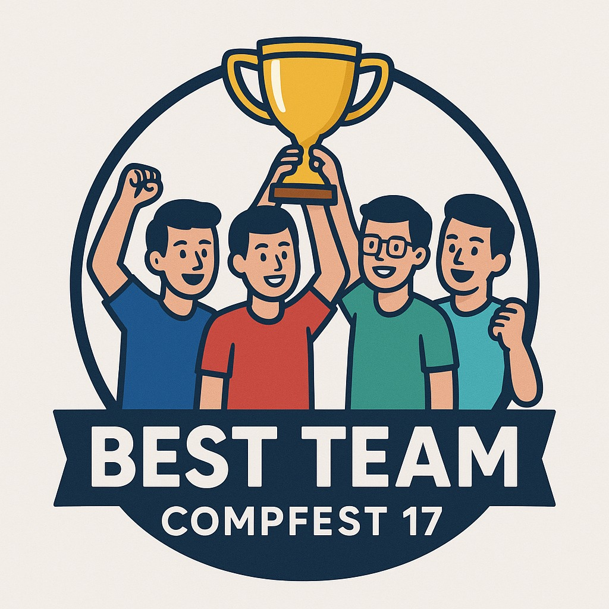

  
  <h1>Calon Best Team</h1>
  
<strong>Developer Team dari CalisFun untuk Final Project SEA Academy Compfest 17</strong>

  
Cerdas Sejak Dini, Seru Sepanjang Hari

   

---

## 🚀 Tentang Kita

Calon Best Team adalah Tim 1 dalam Kegiatan Compfest SEA Academy KE-17. Tim yang terdiri dari 4 orang dengan latar belakang berbeda-beda bersatu untuk membentuk sebuah aplikasi hebat dan bermanfaat bagi banyak orang. Kami membuat CalisFun!

CalisFun adalah sebauh platform pembelajaran digital yang revolusioner untuk mengembangkan kemampuan Calistung (Baca, Tulis, Hitung) anak-anak Indonesia dengan cara yang menyenangkan dan efektif.

### Visi
Menjadi platform pembelajaran digital terdepan di Indonesia yang memberdayakan setiap anak untuk menguasai kemampuan dasar Calistung dengan cara yang menyenangkan, inovatif, dan mudah diakses oleh seluruh lapisan masyarakat.

### Misi
- Mengembangkan metode pembelajaran yang inovatif dan menyenangkan
- Memberikan akses pendidikan berkualitas untuk semua anak Indonesia
- Mendukung orang tua dan guru dalam proses pembelajaran anak
- Membangun generasi yang cerdas dan berkarakter

---

## 👥 Tim

Organisasi Tim ini dibuat oleh Team 1 pada SEA Academy Compfest 17

<ul>
<li>Stanley Nathanael Wijaya - Fullstack Developer</li>
<li>Haikal Iman F - Mobile Developer</li>
<li>Muhammad Favian Jiwani - Mobile Developer</li>
<li>Raditya Ramadhan - Backend Developer</li>
<li>Muhammad Ridho Ananda - Backend Developer</li>
</ul>

---

## 📧 Kontak

Jika ada pertanyaan atau ingin kolaborasi bisa kontak melalui salah satu data berikut ini:

- Email : stanley.n.wijaya7@gmail.com
- Telegram : https://t.me/xstynwx
- Discord : stynw7

---

  Dibuat dengan 🤍 oleh Calon Best Team SEA Academy Compfest 17 🔥

